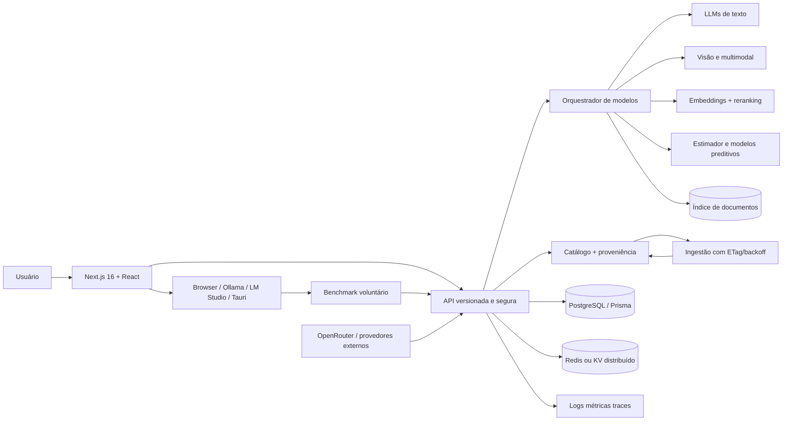

# Proposta de Expansão do 838

**Versão:** 1.0  
**Data:** 2026-09-15  
**Escopo:** evolução do 838 sem abandonar seu objetivo central: responder qual modelo, runtime e configuração fazem sentido para o hardware, objetivo, privacidade e orçamento de cada pessoa.

## 1. Direção

O 838 não deve virar um catálogo genérico de modelos nem um simples painel de chamadas de API. A expansão deve melhorar a decisão do usuário:

> Para esta máquina, este objetivo, este nível de privacidade e este orçamento, o que vale testar agora, com qual configuração e com qual grau de confiança?

Princípios preservados:

- estimativas continuam distinguindo demonstração, heurística e medição;
- dados externos carregam origem, data e confiança;
- o browser ou o agente acessam runtimes locais, nunca o backend hospedado em nome do usuário;
- recursos dependentes de credenciais permanecem atrás de flags;
- Next.js/TypeScript continua sendo o núcleo; novos serviços só entram quando removem uma limitação real;
- PostgreSQL/Prisma armazenam dados persistentes, auditoria, proveniência e permissões;
- a experiência mantém paridade entre Next e preview quando a função existir nos dois ambientes.

## 2. Arquitetura-alvo



### 2.1 Camadas

| Camada | Responsabilidade | Implementação recomendada |
|---|---|---|
| Experiência | onboarding, dashboard, comparação, instalação e explicações | Next.js, React, Tailwind, componentes existentes |
| Contratos | validação, origem, limites, erros, request ID | helpers em `src/server/http`, Zod quando o contrato justificar |
| Orquestração | escolher modelo, aplicar fallback, controlar custo e latência | módulo TypeScript no início; worker separado somente para filas/ingestão |
| Catálogo | modelos, variantes, artefatos, fontes e proveniência | Prisma/PostgreSQL; `SeedCatalogRepository` como fallback |
| Dados semânticos | embeddings, chunks, índice e busca híbrida | pgvector no PostgreSQL ou serviço vetorial compatível |
| Execução local | detecção e benchmark autorizado | browser + Ollama/LM Studio + Tauri/Rust |
| Operação | logs, métricas, alertas, backups e auditoria | logger atual, OpenTelemetry, Prometheus/Grafana ou serviço equivalente |
| Cache | respostas públicas e metadados de curta duração | Redis/KV; nunca cachear sessão, senha, token ou perfil privado |

## 3. Integração de modelos de IA

### 3.1 Modelos de linguagem e raciocínio

| Família / exemplos | Uso no 838 | Integração | Critérios e limites |
|---|---|---|---|
| OpenAI GPT-4.1/GPT-5 ou sucessores equivalentes | explicação de recomendações, sumarização de documentação e assistente de configuração | adaptador HTTPS via OpenRouter ou API oficial; saída estruturada JSON validada | baixa latência e qualidade alta; custo por token; não enviar hardware identificável sem consentimento |
| Anthropic Claude 3.7/4 ou sucessores | explicações longas, comparação de receitas e revisão de documentos | adaptador via provedor autorizado; streaming opcional | bom para contexto longo; custo e retenção do fornecedor devem ser configurados |
| Google Gemini 2.x ou sucessores | multimodalidade e documentos | adaptador oficial ou gateway aprovado | avaliar residência de dados, quota e latência regional |
| Meta Llama 3.3/4 | execução local, privacidade e fallback | Ollama, LM Studio, llama.cpp, vLLM ou endpoint compatível | peso, VRAM, quantização, licença e qualidade por objetivo |
| Qwen3/Qwen-VL | programação, raciocínio, visão e execução local | catálogo seed/persistente, Hugging Face, Ollama e benchmark local | excelente cobertura local; comparar contexto, licença, memória e tokens/s medidos |
| Mistral Small/Large/Magistral | escrita, documentos, raciocínio e API | API oficial, OpenRouter e variantes locais quando disponíveis | latência, custo, licença e idioma; não prometer desempenho sem evidência |
| DeepSeek ou sucessores | programação e raciocínio com opção hospedada/local | OpenRouter/API ou runtime local compatível | revisar políticas de dados e custo; sempre oferecer alternativa local |
| Gemma 3, Phi e modelos compactos | notebook, teste rápido e baixa memória | Ollama/LM Studio/llama.cpp | prioridade para cold start, RAM e consumo energético |

**Regra de integração:** cada adaptador deve converter a resposta externa para um contrato interno com `provider`, `model`, `requestId`, `usage`, `latencyMs`, `cost`, `dataPolicy` e `fallback`. O frontend nunca deve depender do JSON nativo de um fornecedor.

### 3.2 Visão computacional e multimodalidade

| Família / exemplos | Uso no 838 | Integração | Complexidade | Impacto |
|---|---|---|---|---|
| Qwen-VL, Gemma multimodal, Pixtral | entender screenshots de erro, documentação e telas de runtime | endpoint local ou API; imagens ficam no browser até consentimento explícito | alta | reduz configuração manual, mas exige controle forte de privacidade |
| Florence-2, YOLO e modelos de classificação | detectar componentes, screenshots e sinais de hardware | execução local via serviço Python/ONNX somente se o agente precisar | alta | melhora diagnóstico visual, sem substituir dados declarados pelo usuário |
| Flux/SDXL e modelos de imagem equivalentes | opcional para exemplos visuais e documentação de workflows | integração local; nunca parte do caminho crítico do estimador | alta | amplia conteúdo, mas tem custo de armazenamento e licenciamento |
| Whisper/faster-whisper | transcrever vídeo, áudio e notas de benchmark | local via CTranslate2/whisper.cpp ou API com consentimento | média/alta | acelera documentação e acessibilidade; áudio não deve ser enviado por padrão |
| Piper/XTTS e equivalentes | leitura de recomendações e acessibilidade | local ou provedor selecionado | média | melhora acessibilidade, com controle de voz e idioma |

### 3.3 Embeddings, RAG e busca semântica

| Componente | Exemplos | Integração | Complexidade |
|---|---|---|---|
| Embeddings multilíngues | BGE-M3, multilingual-e5, Nomic, embeddings de provedor | batch no job de ingestão; versão do modelo gravada na tabela de documentos | média |
| Reranker | bge-reranker ou reranker hospedado | aplicado somente aos top-N resultados | média |
| Índice | PostgreSQL + pgvector no início; serviço vetorial somente em escala | chunks com `sourceUrl`, `observedAt`, licença e hash | média/alta |
| RAG | documentação de runtimes, receitas, FAQs e changelog | recuperação híbrida lexical + vetorial; resposta deve citar fontes | alta |

O RAG deve responder apenas com documentos recuperados e indicar quando não há evidência. Não deve inventar compatibilidade, preço ou tokens/s.

### 3.4 Recomendação e análise preditiva

O motor atual de compatibilidade continua sendo a fonte explicável inicial. Modelos preditivos só devem ser promovidos quando houver dados suficientes:

- **Baseline:** regras, distância de evidências e estatística do estimador 2.0.0 já existente.
- **Regressão:** LightGBM/XGBoost ou regressão quantílica para prever faixa de tokens/s, memória e probabilidade de caber.
- **Séries temporais:** previsão de preço, disponibilidade e idade de artefatos, sem misturar com confiança de desempenho.
- **Recomendação:** ranking híbrido com filtros determinísticos, score explicável e aprendizado de preferência somente com consentimento.
- **Validação:** MAE, MAPE, cobertura do intervalo, calibração e métricas por GPU, sistema, runtime, idioma e objetivo.

Nenhum modelo preditivo deve substituir a validação determinística de espaço, VRAM, licença, sistema ou requisitos mínimos.

## 4. Critérios de seleção de modelos

Cada chamada deve calcular uma decisão auditável:

1. **Privacidade:** local primeiro quando o perfil marcar privacidade; dados sensíveis nunca enviados sem consentimento.
2. **Latência:** tempo até primeiro token, tempo total, cold start e p95; usar fallback quando exceder o orçamento.
3. **Custo:** custo por entrada/saída, custo estimado da tarefa e custo de energia local quando disponível.
4. **Qualidade:** avaliação por objetivo, idioma, formato estruturado e taxa de erro.
5. **Capacidade:** contexto, modalidades, ferramentas e tamanho máximo de resposta.
6. **Disponibilidade:** quota, health check, timeout, circuit breaker e região.
7. **Hardware:** VRAM/RAM, armazenamento, backend, quantização e suporte do runtime.
8. **Licença e política:** uso comercial, retenção, treinamento sobre dados e localização do processamento.
9. **Reprodutibilidade:** versão do modelo, adaptador, prompt/contrato e data da evidência.

Exemplo de política de roteamento:

- tarefa privada e compatível: local;
- tarefa privada incompatível com a máquina: pedir consentimento antes de API;
- tarefa pública de baixa latência: modelo barato com cache;
- documento longo: modelo com contexto suficiente ou RAG por partes;
- falha externa: fallback local ou resposta honesta de indisponibilidade;
- custo acima do orçamento: bloquear ou pedir confirmação.

## 5. Funcionalidades adicionais recomendadas

### 5.1 Dashboard de dados em tempo real

**Descrição técnica:** painel de latência, disponibilidade, custo, benchmarks, catálogo, idade dos dados e uso por provedor. Atualização por polling curto no MVP e SSE/WebSocket apenas para eventos realmente contínuos.

**Stack:** Next.js Server Components, TanStack Query para dados assíncronos, PostgreSQL, Redis/KV, Recharts ou visualizações acessíveis, OpenTelemetry.

**Complexidade:** alta.  
**Impacto:** permite comparar decisões com evidência atual, detectar fornecedor degradado e reduzir surpresa de custo. Não colocar telemetria privada no painel público.

### 5.2 Automação de workflows com triggers de IA

**Descrição técnica:** workflows versionados como JSON tipado: evento, condição, ação, aprovação, retry, timeout e auditoria. Triggers podem ser “benchmark novo”, “modelo incompatível”, “preço alterado” ou “documento atualizado”. A IA sugere ações; o usuário confirma ações destrutivas.

**Stack:** PostgreSQL, fila BullMQ/Redis ou serviço gerenciado, Zod, worker Node; Temporal somente quando a durabilidade justificar.

**Complexidade:** alta.  
**Impacto:** reduz tarefas repetitivas de atualização e instalação, sem permitir que texto gerado execute shell automaticamente.

### 5.3 API robusta e ecossistema de plugins

**Descrição técnica:** API versionada, OpenAPI, scopes, idempotency key, pagination, quotas, webhooks assinados e SDK TypeScript. Plugins registram capacidades declarativas, não código arbitrário dentro do processo web.

**Stack:** Route Handlers Next existentes, Zod, OpenAPI gerado, Better Auth/OAuth2, PostgreSQL, HMAC/Ed25519 para webhooks.

**Complexidade:** alta.  
**Impacto:** integra IDEs, runtimes, catálogos e parceiros sem acoplar o núcleo.

### 5.4 Colaboração multiusuário e permissões granulares

**Descrição técnica:** organizações, membros, papéis Owner/Admin/Editor/Viewer, convite, auditoria e versionamento de cenários/catálogos. Alterações importantes devem ser append-only ou possuir histórico.

**Stack:** Better Auth + plugin de organizações quando compatível, PostgreSQL, Prisma, políticas de autorização no servidor, testes de matriz de permissões.

**Complexidade:** alta.  
**Impacto:** habilita equipes, suporte e curadoria comunitária. Não ativar antes de sessão, revogação, MFA e logs de auditoria estarem testados.

### 5.5 Personalização adaptativa

**Descrição técnica:** preferências explícitas primeiro; aprendizado opcional por eventos agregados e desidentificados. Usar contextual bandit somente depois de possuir volume e consentimento suficientes.

**Stack:** tabela de eventos PostgreSQL, jobs de agregação, regras TypeScript; Python/LightGBM somente na fase de dados.

**Complexidade:** média/alta.  
**Impacto:** reduz repetição e melhora ranking de modelos, sem criar perfil oculto invasivo.

### 5.6 Segurança avançada

**Descrição técnica:** MFA/WebAuthn, sessões revogáveis, RBAC/ABAC, detecção de anomalias em login e API, criptografia em trânsito e em repouso, envelope encryption para segredos e rotação.

**Stack:** Better Auth + WebAuthn/passkeys, PostgreSQL, KMS/secret manager do provedor, Redis para rate limit, OpenTelemetry, regras de alerta.

**Complexidade:** alta.  
**Impacto:** protege contas, benchmarks e credenciais. E2E de dados de usuário deve ser adotado apenas quando recuperação e busca forem desenhadas para não exigir plaintext no servidor.

### 5.7 Notificações inteligentes

**Descrição técnica:** centro de notificações com severidade, relevância, deduplicação, quiet hours e preferências. A IA classifica relevância, mas regras determinísticas controlam alertas críticos.

**Stack:** PostgreSQL, worker/fila, Web Push, e-mail transacional opcional; modelo pequeno local/API para classificação.

**Complexidade:** média.  
**Impacto:** alerta sobre incompatibilidade, benchmark concluído, modelo indisponível ou custo elevado sem gerar ruído.

### 5.8 Internacionalização e acessibilidade

**Descrição técnica:** mensagens, datas, unidades e conteúdo de modelo internacionalizados; navegação teclado, foco, contraste, leitor de tela e redução de movimento em WCAG 2.1 AA.

**Stack:** next-intl ou solução equivalente, ICU MessageFormat, axe-core, Playwright, percurso manual com NVDA/VoiceOver/TalkBack.

**Complexidade:** média.  
**Impacto:** aumenta alcance e compreensão; não traduzir nomes/licenças/fontes que precisam permanecer canônicos.

### 5.9 Cache distribuído e performance

**Descrição técnica:** cache público por versão e ETag para catálogo; stale-while-revalidate para dados externos; cache privado por usuário somente com chave isolada. Circuit breaker e backoff para provedores.

**Stack:** Redis/KV, `Cache-Control`, ETag, Next caching, `fetch` com timeout, OpenTelemetry.

**Complexidade:** média/alta.  
**Impacto:** menor latência e custo. APIs de auth, mutações, perfil e recomendações personalizadas devem usar `no-store`.

### 5.10 Observabilidade completa

**Descrição técnica:** logs estruturados, métricas RED, traces, p50/p95/p99, custo por provedor, erro por etapa, health/readiness, alertas e SLOs. Dados pessoais, tokens e prompts devem ser redigidos.

**Stack:** OpenTelemetry, OTLP, Grafana/Prometheus/Loki/Tempo ou plataforma gerenciada, logger fechado já existente.

**Complexidade:** média/alta.  
**Impacto:** reduz tempo de diagnóstico e permite medir confiabilidade real sem transformar o produto em vigilância.

## 6. Orquestração multi-modelo

O orquestrador deve ser uma biblioteca interna com contratos tipados:

```ts
type ModelTask = {
  kind: "recommendation-explanation" | "document" | "vision" | "embedding" | "prediction";
  input: unknown;
  privacy: "local-only" | "consent-required" | "public";
  latencyBudgetMs: number;
  costBudgetUsd?: number;
};

type ModelDecision = {
  provider: string;
  model: string;
  route: "local" | "api";
  reason: string[];
  fallback?: string;
};
```

Fluxo recomendado:

1. validar tarefa e consentimento;
2. classificar objetivo, idioma, modalidade e sensibilidade;
3. filtrar modelos incompatíveis por licença, capacidade e hardware;
4. estimar latência/custo;
5. selecionar modelo primário e fallback;
6. executar com timeout, retry limitado e circuit breaker;
7. validar saída estruturada e fontes;
8. registrar somente metadados operacionais permitidos;
9. devolver resultado, origem, confiança, custo e motivo da escolha.

Não fazer fan-out indiscriminado para vários provedores. Paralelismo deve ser reservado para tarefas em que a comparação realmente melhora a decisão e deve respeitar orçamento.

## 7. Roadmap

### Fase MVP — base segura e valor imediato

**Objetivo:** ampliar sem transformar o 838 em plataforma distribuída prematuramente.

- finalizar PostgreSQL persistente e catálogo com ETag/backoff;
- adaptar OpenRouter e fontes externas a contratos versionados;
- adicionar custo, latência e data da consulta ao catálogo de APIs;
- concluir sessão, login, MFA e revogação com ambiente staging;
- adicionar OpenAPI de leitura para catálogo, modelos e recomendações;
- melhorar telemetria com p95 e falhas por fornecedor;
- concluir PWA em HTTPS e teste físico;
- adicionar i18n base e auditoria WCAG AA;
- manter seed fallback e flags de ativação.

**Critério de saída:** build, CI, migrations, smoke público, segurança e fluxos de usuário aprovados.

### Versão 1.0 — produto colaborativo confiável

- organizações e permissões Owner/Admin/Editor/Viewer;
- cenários versionados e histórico de recomendações;
- RAG de documentação com fontes citáveis;
- dashboard de benchmarks/custo/latência;
- notificações configuráveis;
- cache distribuído e circuit breaker;
- moderação comunitária e política de retenção;
- plugin registry declarativo e webhooks assinados;
- coleta v2 no agente Linux e distribuição nativa validada.

**Critério de saída:** SLO definido, restore drill aprovado, auditoria de autorização, custo controlado e dados com proveniência.

### Versão 2.0 — inteligência adaptativa e ecossistema

- roteamento multi-modelo com política de privacidade e orçamento;
- modelos preditivos calibrados contra conjunto oculto real;
- personalização adaptativa com consentimento;
- visão, voz e transcrição local/API;
- histórico comunitário comparável;
- SDKs e plugins externos com sandbox/capabilities;
- agentes Windows/macOS assinados e notarizados;
- previsão de custo/energia e recomendações por workflow.

**Critério de saída:** avaliação de segurança independente, benchmark representativo, rollback documentado e suporte operacional.

## 8. Riscos e mitigação

| Risco | Consequência | Mitigação |
|---|---|---|
| dependência excessiva de API | custo, indisponibilidade e vazamento | local-first, consentimento, quotas, cache público e fallback |
| alucinação no RAG | recomendação incorreta | fontes obrigatórias, resposta “sem evidência”, avaliação e revisão |
| dados de hardware identificáveis | risco de privacidade | minimização, hash/ID de instalação, retenção curta e opt-in |
| cache servir dados privados | exposição entre usuários | chaves por usuário, `no-store` para auth/mutações e testes de isolamento |
| prompt injection em documentos | execução ou resposta manipulada | separar instruções de dados, sanitizar conteúdo e nunca executar saída |
| custo imprevisível | surpresa financeira | orçamento por tarefa, circuit breaker, confirmação e alertas |
| drift de catálogo/modelo | estimativa obsoleta | ETag/backoff, snapshots, `observedAt`, versão e fallback seed |
| expansão excessiva de stack | manutenção e falhas | começar em TypeScript/Next; adicionar Python/Redis apenas por métrica |
| plugin malicioso | exfiltração ou execução | manifesto de capabilities, sandbox, assinatura e revisão |
| MFA mal implementado | bloqueio ou conta comprometida | WebAuthn/passkeys, códigos de recuperação e teste de recuperação |
| métricas enviesadas | ranking injusto | cobertura por hardware, confiança, intervalos e avaliação por categoria |
| dependências e supply chain | vulnerabilidades | lockfile, SBOM, OSV, Actions fixadas, atualização isolada e rollback |
| offline com dados antigos | decisões erradas | cache público versionado, indicação de stale e exclusão de APIs privadas |

## 9. Métricas de sucesso

- tempo até primeira recomendação e p95 por rota;
- taxa de recomendações com evidência e origem explícitas;
- cobertura do intervalo preditivo e MAE/MAPE por categoria;
- taxa de fallback por fornecedor;
- custo médio por tarefa e percentual local/API;
- taxa de instalação/ativação do PWA;
- erro de login, revogação e recuperação;
- violações WCAG sérias/críticas;
- tempo de recuperação e sucesso do restore drill;
- retenção e exclusão de dados conforme a política;
- taxa de decisões corrigidas por benchmark real.

## 10. Decisões que permanecem pendentes

Não ativar automaticamente:

- autenticação de produção sem HTTPS, e-mail e PostgreSQL hospedado;
- rate limit distribuído sem Redis/KV e configuração de proxy confiável;
- coleta externa sem termos, quotas, licença e proveniência definidos;
- modelos de visão/voz que enviem dados sem consentimento;
- agentes Windows/macOS sem assinatura, notarização e teste físico;
- plugins com execução arbitrária;
- personalização baseada em comportamento sem consentimento e política de retenção;
- previsões de desempenho promovidas sem conjunto real oculto.

Essas pendências estão detalhadas em [permissoes_do_dev.txt](../permissoes_do_dev.txt). A implementação existente deve continuar funcionando em modo seed, local e sem conta enquanto as dependências externas não forem aprovadas.
